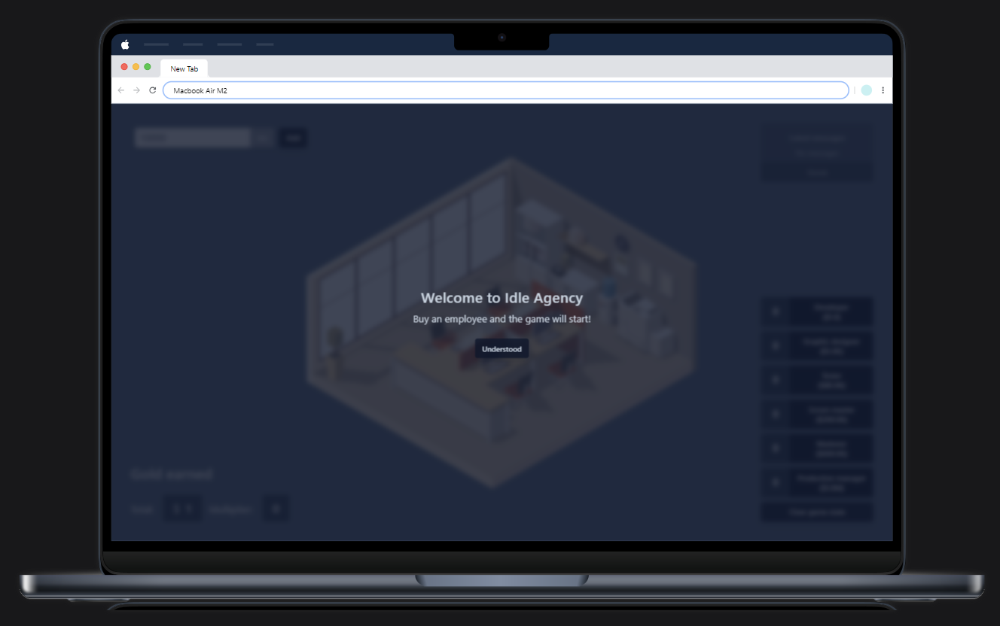
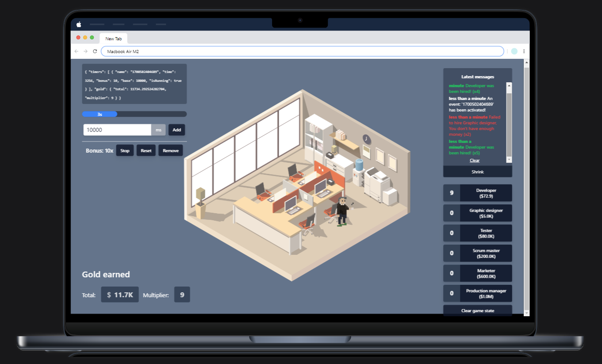

# Idle Agency Game

This is a [React](https://reactjs.org) + [TypeScript](https://www.typescriptlang.org/) + [Tailwind](https://tailwindcss.com/) + [RTK](https://redux-toolkit.js.org/) + [eslint](https://eslint.org/) boilerplate built with [Vite](https://vitejs.dev).

## In-Game Preview

<p align="center">
   <a href="./welcome.png" target="_blank">
      
   </a>
   <a href="./in-game.png" target="_blank">
      
   </a>
</p>

## What's inside?

- [ReactJS](https://reactjs.org)
- [Vite](https://vitejs.dev)
- [TypeScript](https://www.typescriptlang.org)
- [Tailwind](https://tailwindcss.com/)
- [RTK](https://redux-toolkit.js.org/)
- [ESLint](https://eslint.org)

## Getting started

1. Clone the repository.

   ```bash
   git clone https://github.com/IsaiaPhiliph/vite-reactts-tailwind-rtk-eslint.git
   ```

2. Access the project.

   ```bash
   cd vite-reactts-tailwind-rtk-eslint
   ```

3. Make it your own repository

   ```bash
   rm -rf .git
   git init
   ```

4. Install dependencies.

   ```bash
   npm i
   ```

5. Start the development server.

   ```bash
   npm run dev
   ```

6. Build for production.

   ```bash
   npm run build
   ```

7. Test your production build.

   ```bash
   npm run serve
   ```
